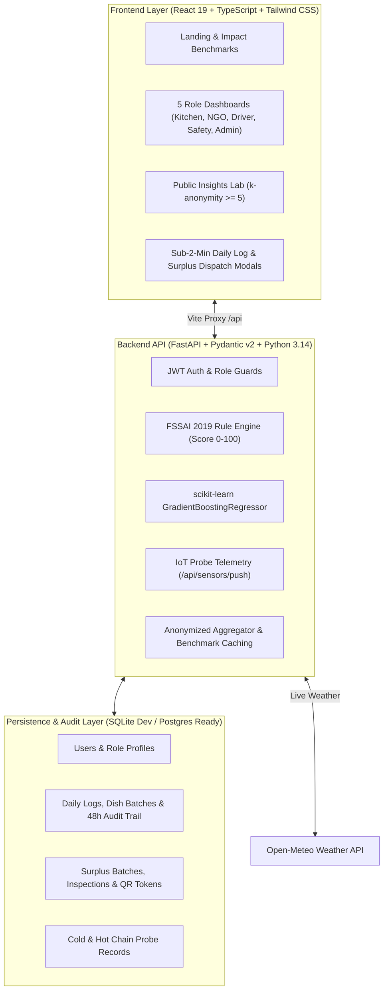

# FoodLoop — Multi-Stakeholder Food Intelligence & Surplus Redistribution Platform

> Built in compliance with India's **FSSAI Food Safety and Standards (Recovery and Distribution of Surplus Food) Regulations, 2019**.
> Designed for institutional kitchens (college messes, hostels, corporate cafeterias, caterers, hotels, and hospitals) and verified food banks.

---

## 1. System Architecture



---

## 2. Seeded Demo Workspace Credentials

FoodLoop includes an isolated sandbox environment pre-populated with 16 days of kitchen records, FSSAI temperature logs, and active delivery runs. Demo data is strictly flagged `is_demo = true` and **never** mixes with real accounts or the public Insights Lab.

| Role | Email | Password | Organization | Key Feature Focus |
|---|---|---|---|---|
| **Kitchen Manager** | `kitchen.demo@foodloop.in` | `DemoKitchen@2026` | IISc Central Dining Hall | AI GradientBoosting forecast, sub-2-min daily log, FEFO stock alerts |
| **Food Safety Officer** | `safety.demo@foodloop.in` | `DemoSafety@2026` | FSSAI State Cell | 6-point Schedule 4 checklist, live probe check, score calculator |
| **NGO / Food Bank** | `ngo.demo@foodloop.in` | `DemoNgo@2026` | Annapoorna Foundation | Nearby vetted food marketplace, safe expiry countdown, capacity matching |
| **Delivery Partner** | `driver.demo@foodloop.in` | `DemoDriver@2026` | Quick-Thermal Logistics | Assigned jobs, OSRM route, QR/OTP handshake, beneficiary verification |
| **Admin / ESG Manager** | `admin.demo@foodloop.in` | `DemoAdmin@2026` | State Dining Directorate | Prepared vs Discarded %, WRAP CO2e avoided, INR saved, CSV/PDF export |

> **Quick Switch:** You can also switch between any role instantly using the **"Switch Role"** button in the top navigation bar.

---

## 3. Data Sources & Regulatory Compliance Register

Every number on FoodLoop is either user-entered, sourced from public archives, or calculated via documented scientific models.

| Data Source | Official Reference | Usage in FoodLoop | Real / Simulated |
|---|---|---|---|
| **FSSAI Surplus Regulations 2019** | [fssai.gov.in](https://fssai.gov.in) | Hot holding mandate (&ge;60°C), cold holding (&le;5°C), 2-4h safe window, Schedule 4 checklist | **Real Statutory Standard** |
| **UNEP Food Waste Index 2024** | [unep.org](https://www.unep.org/resources/publication/food-waste-index-report-2024) | India urban per-capita waste (78 kg/person/year; 78.2M tonnes gross) | **Real Published Benchmark** |
| **WRAP Carbon Metric & IPCC AR6** | [wrap.org.uk](https://wrap.org.uk/resources/guide/food-waste-carbon-metric) | Greenhouse factor: 2.5 kg CO2e avoided per 1.0 kg food waste diverted from landfill | **Real Documented Factor** |
| **ICMR-NIN Dietary Guidelines 2020** | [nin.res.in](https://www.nin.res.in/) | Wholesome meal norm: 400 grams cooked mass per adult standard meal | **Real Standard** |
| **Open-Meteo Weather API** | [open-meteo.com](https://open-meteo.com/) | Live temperature, humidity, and rainfall integration for forecasting | **Real Live API** |
| **data.gov.in (TPDS Data)** | [data.gov.in](https://data.gov.in/resource/state-wise-allocation-and-offtake-foodgrains) | District-level food grains buffer stocks & public distribution context | **Real Government Data** |
| **FSSAI 14-Digit Licence Number** | [foscos.fssai.gov.in](https://foscos.fssai.gov.in/) | 14-digit numeric validation & designated officer review workflow | **Real Format Validation** |
| **Demo Workspace Sandbox** | Internal | Pre-seeded sample records for immediate evaluation | **Isolated Simulated Mode** |

---

## 4. Local Setup & Execution Guide

### Prerequisites
- Node.js v18+ (tested on v24.21.0)
- Python 3.10+ (tested on Python 3.14)
- npm v9+

### 1. Start FastAPI Backend
```bash
# In project root:
uvicorn backend.main:app --host 127.0.0.1 --port 8000 --reload
```
The backend initializes SQLite schema (`backend/foodloop.db`) and exposes interactive OpenAPI documentation at `http://127.0.0.1:8000/docs`.

### 2. Start Frontend Dev Server
```bash
# In a separate terminal in project root:
npm run dev
```
Open **`http://localhost:5173/`** in your browser.

---

## 5. User Guides & Key Workflows

### A. Creating Your First Real Account
1. Click **Sign In** &rarr; **Register** tab.
2. Select your role (**Kitchen / Donor**).
3. Enter your kitchen name, city, official contact phone (privacy protected), and password.
4. Your account starts **100% empty**. The dashboard guides you through your initial 2-minute daily service log.

### B. Logging Daily Meal Counts (< 2 Mins)
1. In the Kitchen Dashboard, click **"+ Daily Log (< 2 min)"**.
2. Select date and meal (Breakfast, Lunch, Dinner).
3. Enter Expected Headcount and Actual Headcount served.
4. For each dish, input Prepared (kg), Served (kg), Safe Leftover (kg), and Discarded (kg).
5. The system verifies that `Served + Leftover + Discarded <= Prepared` and saves the audit record. Records can be revised within 48 hours.

### C. Bulk Register CSV Import
1. In Kitchen Dashboard, click **"Bulk CSV Import"**.
2. Click **"Download CSV Template"** to get the standard format.
3. Upload your CSV. The engine validates every line and generates a row-by-row error report (e.g. `Row 7: Served exceeds Prepared`).
4. Valid records are ingested to immediately train your kitchen's forecasting model.

### D. Connecting a Real IoT Temperature Sensor
1. In Kitchen Dashboard or Settings, click **"Connect IoT Hardware / REST API"**.
2. Generate an API Key (e.g., `fl_sensor_...`).
3. Configure your ESP32, Raspberry Pi, or LoRaWAN gateway to push readings:
```bash
curl -X POST http://localhost:8000/api/sensors/push \
  -H "Content-Type: application/json" \
  -H "X-Sensor-API-Key: YOUR_GENERATED_KEY" \
  -d '{"sensor_id": "ESP32-KETTLE-01", "probe_location": "hot_holding_well", "temperature_c": 67.4}'
```
Readings below 60°C trigger an automatic FSSAI danger-zone temperature alert.

---

## 6. Verification Checklist

- [x] **Zero Fake Data on New Accounts:** Fresh accounts display actionable empty states.
- [x] **Cold-Start Forecasting Heuristic:** Days 0–13 use transparent weekday/meal averages. Days 14+ switch to scikit-learn GradientBoosting with automated baseline fallback.
- [x] **FSSAI 2019 Safety Rules:** Hot holding &ge;60°C and cold holding &le;5°C strictly enforced. Disqualified lots cannot be listed.
- [x] **Public Insights Lab Privacy:** k-Anonymity (&ge;5 kitchens) strictly enforced. Anonymized CSV export provided.
- [x] **Role Access Isolation:** NGOs only see approved, unexpired food. Drivers only see assigned runs. Researchers only see anonymized aggregates.
- [x] **Data Sovereignty (DPDP):** Instant personal CSV export and permanent account deletion button.
